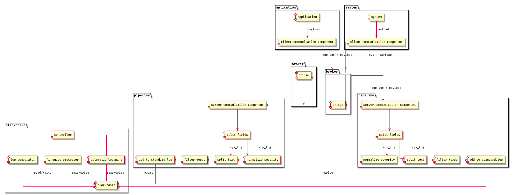
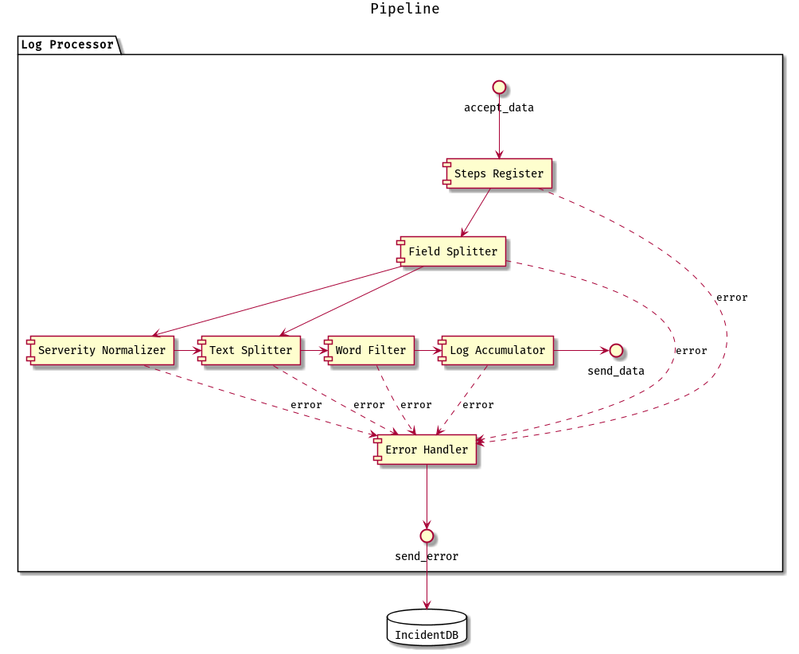
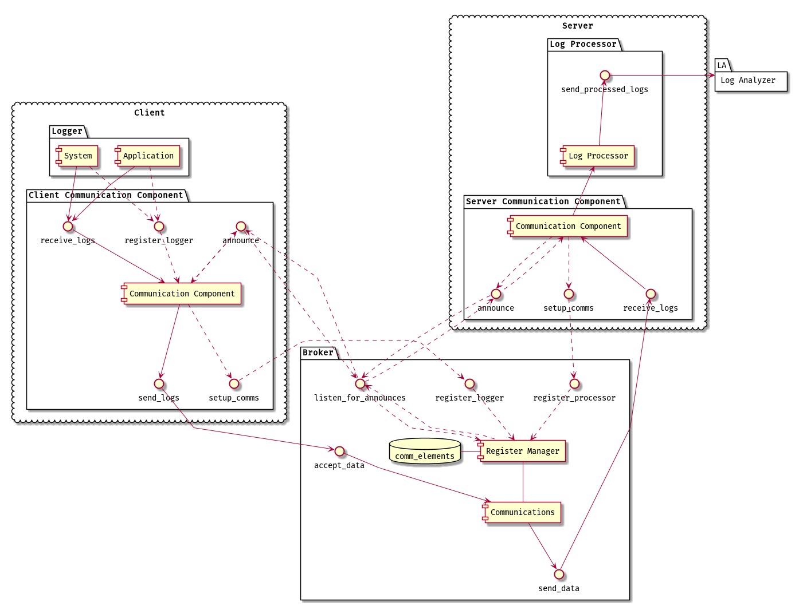
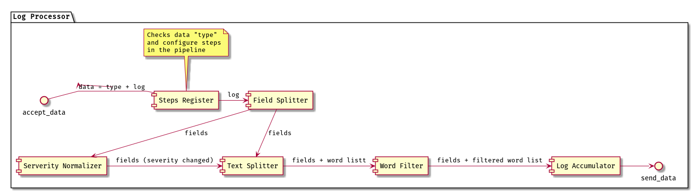
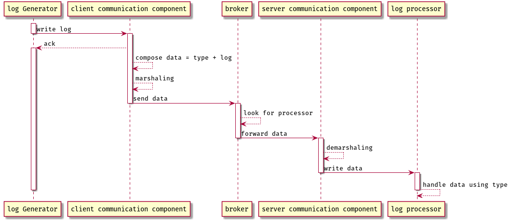
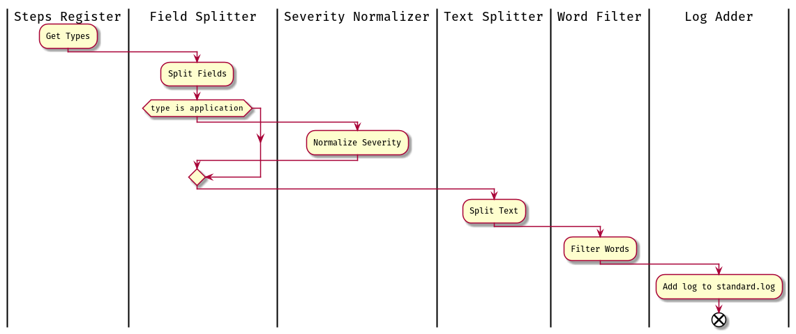

# 
Memoria Práctica final  de  Arquitectura Software.

    
    
#### 
 Sonia Pardillo

#### 
 Jose Manuel Almaza

#### 
 Jose Luis Ojosnegros

## 1.- Decidir y justificar el patrón o patrones arquitectónicos a aplicar para la aplicación.

Los patrones elegidos han sido

1. Broker
2. Pipeline
3. Blackboard

Aquí podemos ver un diagrama general de la arquitectura propuesta:

### Patrón Broker
#### Fuerzas y Consecuencias

El procesado de los logs se ha convertido en un cuello de botella de manera que necesitamos una manera en la que poder distribuir ese procesado para repartir la carga. Para poder además aumentar o disminuir según las necesidades, la potencia de procesado necesitamos ser capaces de dar de alta o de baja elementos de procesado sin que los generadores de log se vean impactados.

Esto lo podemos conseguir mediante la utilización del __patrón Broker__ que permite abstraer a los elementos que generan logs de la situación de aquellos que proveen el servicio de procesado de los mismos. Además conseguimos poder repartir la carga entre los distintos procesadores ya que los generadores no conocen a los procesadores.

También es importante el poder introducir nuevos generadores de logs en el sistema, tanto de los tipos conocidos como de otros tipos nuevos, con el menor impacto posible para el mismo. Si el nuevo generador es de un tipo conocido en el sistema (actualmente aplicaciones o sistemas) el impacto es aproximadamente nulo, siempre que la carga
actual del sistema no este cerca del límite, en cuyo caso simplemente habría que añadir nuevos elementos procesadores de logs. En el caso de que se tratase de un nuevo tipo de generador de log, si que tendríamos que modificar los procesadores de logs para que fueran capaces de procesar este nuevo tipo, pero dicha modificación no afectaría a los procesados que se lleven a cabo en el sistema actualmente.

#### Responsabilidades

Debido a la deslocalización de los procesadores de logs deberíamos de proveer de un sistema de autodescubrimiento tanto para los elementos generadores de logs como para los elementos procesadores. Este sistema podría perfectamente estar incluido dentro de los _communication components_ que se ven en el diagrama y que independizan a los elementos de los detalles de las comunicaciones en el sistema.

### Patrón Pipeline
#### Fuerzas y Consecuencias

Se pide que exista una flexibilidad en el sistema a la hora de realizar el procesamiento de los logs de manera que se pueda modificar, eliminar o añadir etapas dentro de las definidas. Esto junto con el hecho de que el procesado de los logs esta evidentemente dirigido por el flujo de los datos a través de distintas etapas, hace que utilizar el __patrón Pipeline__ dentro de cada uno de los elementos de procesado de logs parezca los más apropiado.

#### Responsabilidades

Como podemos ver en el diagrama de detalle del pipeline, cuando una de las etapas encuentra un error a la hora de procesar los logs lo envia a un elemento de procesado de errores que
a su vez lo envía a una base de datos desde donde después esta información podrá ser consultada.

### Patrón Blackboard
#### Fuerzas y Consecuencias
En la descripción del problema se deja claro que el sistema de análisis de logs es no determinista y que se requiere de la colaboración de varios elementos expertos en distintas áreas (aprendizaje automático, procesado de lenguajes naturales, .. ) para poder llegar a una posible solución. Todo esto nos lleva a pensar que el __patrón Blackboard__ sea el más adecuado.

Mediante la aplicación de dicho patrón, y dado que todos los elementos que trabajan para la composición de la solución trabajan sobre el mismo grupo de datos, podemos conseguir la requerida flexibilidad a la hora de añadir, modificar y eliminar herramientas de análisis, así como asegurar el contexto adecuado para realizar el análisis ya que todos los logs terminan entrando en el blackboard.

#### Responsabilidades

## 2.- Definir la estructura de la solución indicando cómo se corresponden los elementos de la solución con los elementos definidos en la estructura del patrón o patrones utilizados.
### Broker y comunicaciones

Los llamados "Client Communication Component" harían las veces de proxies del cliente, encargándose de anunciar su existencia al Broker, contestando este mediante la manera de acceder al interface de configuración de comunicaciones para que el proxy pueda registrarse correctamente ante el Broker.

El Logger deberá registrarse en su proxy indicando su tipo, que actualmente solo podría ser: "application" o "system".

Cuando el Logger envíe tramas de log a su proxy este las reenviará a un procesador de logs mediante el Broker.

El elemento "Register Manager" se encargará de mantener un registro tanto de clientes como de servidores registrados, así como de un listado de los servicios que estos últimos ofrecen.
Cuando un proxy de cliente envíe datos al broker, el elemento "Communications" pedirá al "Register Manager" un servidor a quien redirigirle la trama de entre todos los registrados.

Por otro lado el "Server Communication Component" realizaría las labores inversas a las del "Client Communication Component", abstrayendo así a los servidores de las comunicaciones y funcionando por tanto como un proxy en el lado del cliente.

### Pipeline

La primera de las etapas de este Pipeline se encargaría de, en función del valor del campo "type" recibido en la trama, "programar" los elementos del pipeline que atravesará dicha trama, ya que el tratamiento de los logs de un elemento de tipo "application" es ligeramente diferente del tratamiento para los de un elemento de tipo "system".

## 3.- Definir la dinámica de la solución, señalando el comportamiento de los diferentes elementos del patrón o patrones ante los diferentes tipos de acciones
### Secuencia de Comunicaciones entre los generadores de logs y los procesadores

### Actividad del Pipeline

